# Data Flow Architecture - PRD Tool

## 1. Core Data Flows

### 1.1 PRD Creation Flow
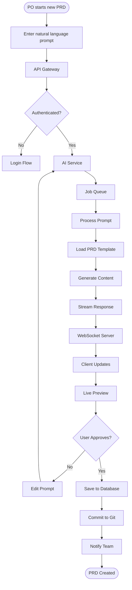

### 1.2 Real-time Collaboration Flow
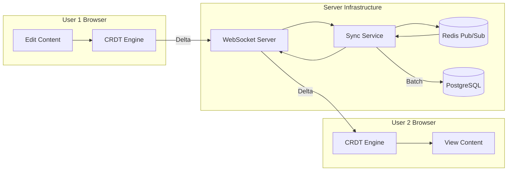

### 1.3 AI Content Generation Flow
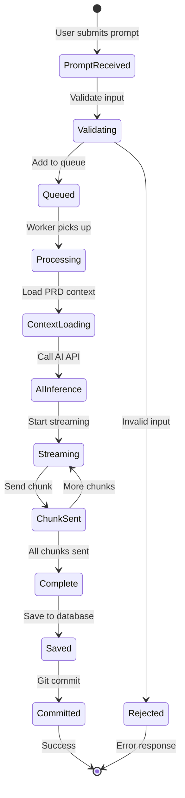

## 2. Data Transformation Pipeline

### 2.1 Input Processing
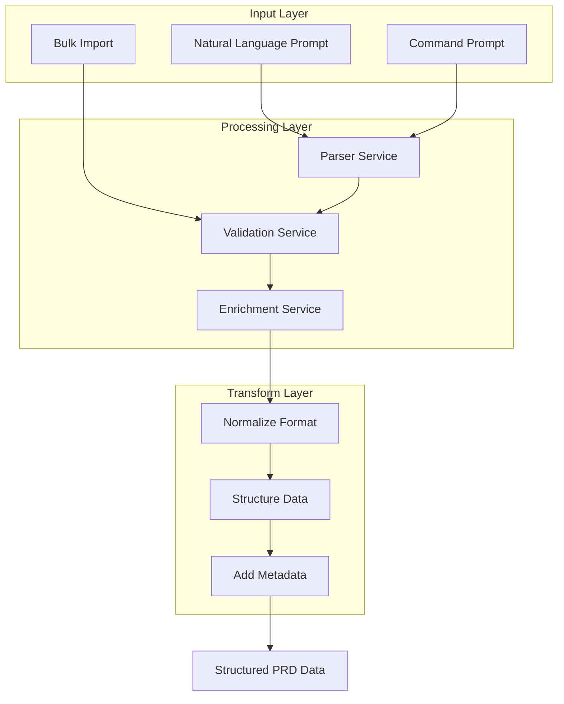

### 2.2 Output Generation
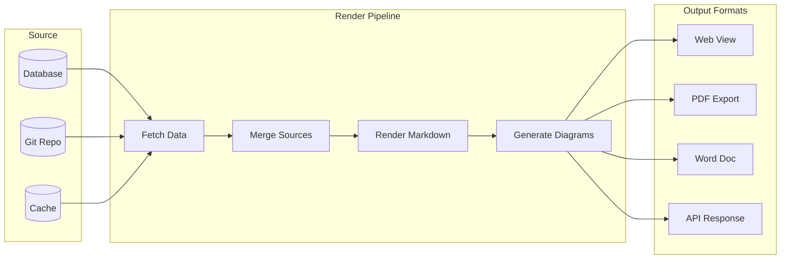

## 3. State Management

### 3.1 Client State Flow
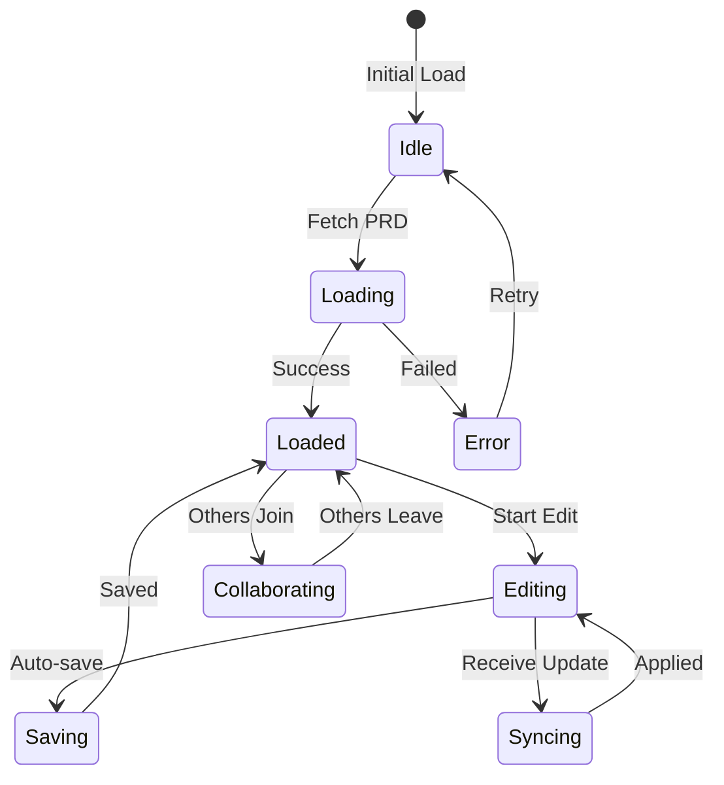

### 3.2 Server State Synchronization
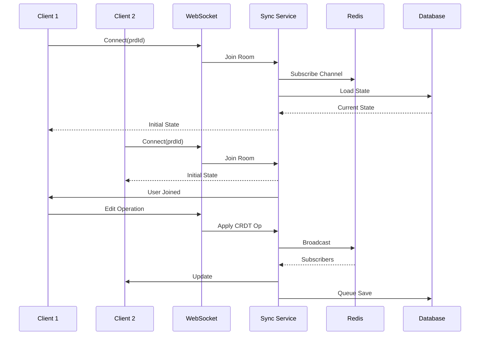

## 4. Data Persistence Strategy

### 4.1 Write Path
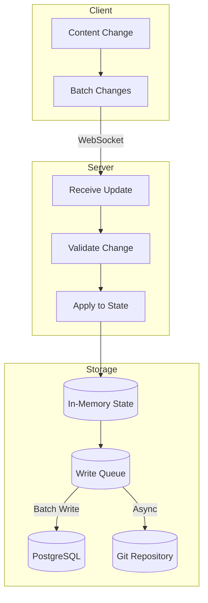

### 4.2 Read Path
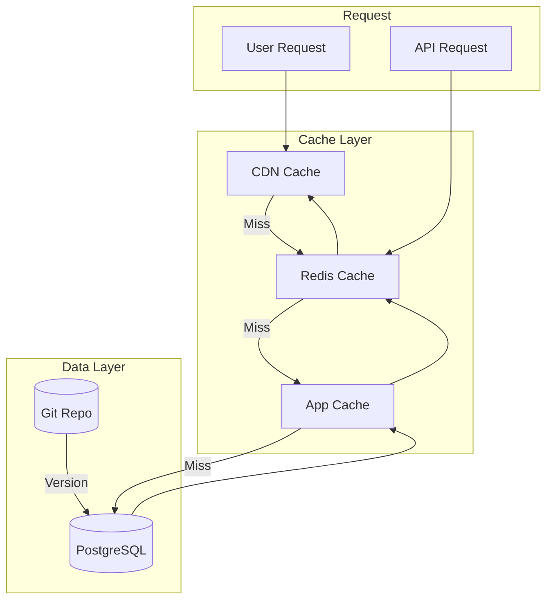

## 5. Event-Driven Architecture

### 5.1 Event Flow
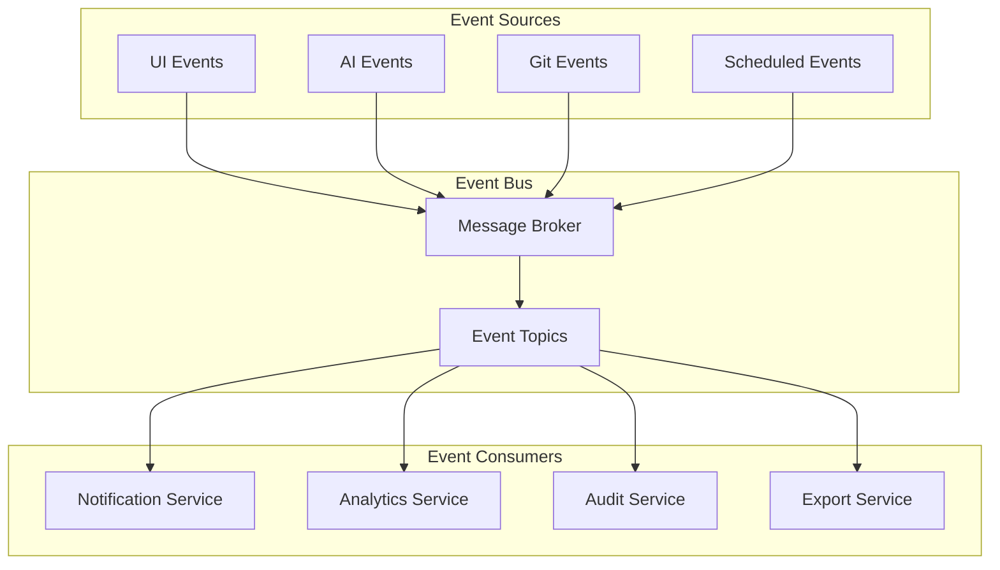

### 5.2 Event Types
```yaml
# User Events
- prd.created
- prd.updated
- prd.deleted
- prd.version.created
- prd.approved
- prd.exported

# Collaboration Events
- user.joined
- user.left
- content.changed
- cursor.moved
- selection.changed

# AI Events
- ai.prompt.submitted
- ai.generation.started
- ai.generation.completed
- ai.generation.failed

# System Events
- git.commit.created
- git.conflict.detected
- backup.completed
- metrics.collected
```

## 6. Error Handling & Recovery

### 6.1 Error Flow
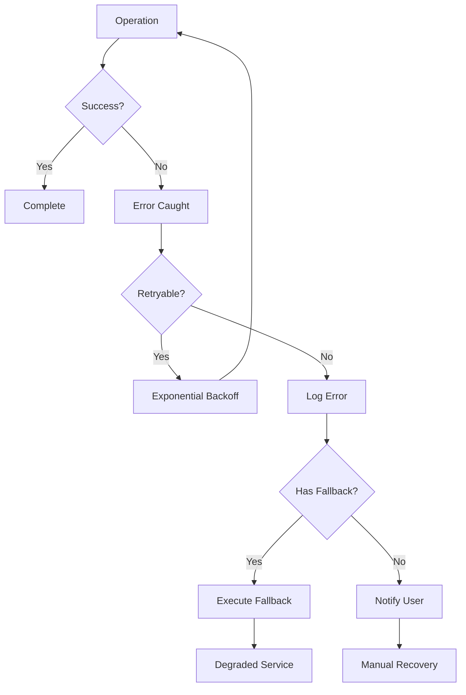

### 6.2 Data Recovery Strategy
- **Client**: Local storage for offline changes
- **Server**: Write-ahead logging
- **Database**: Point-in-time recovery
- **Git**: Full version history
- **Backups**: Hourly snapshots

## 7. Performance Optimization

### 7.1 Caching Strategy
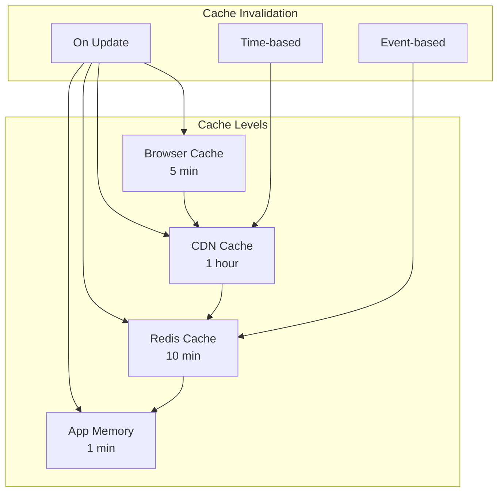

### 7.2 Data Loading Strategy
- **Lazy Loading**: Load sections as needed
- **Prefetching**: Anticipate user actions
- **Streaming**: Progressive content delivery
- **Pagination**: Large document handling
- **Compression**: Gzip/Brotli for transfers