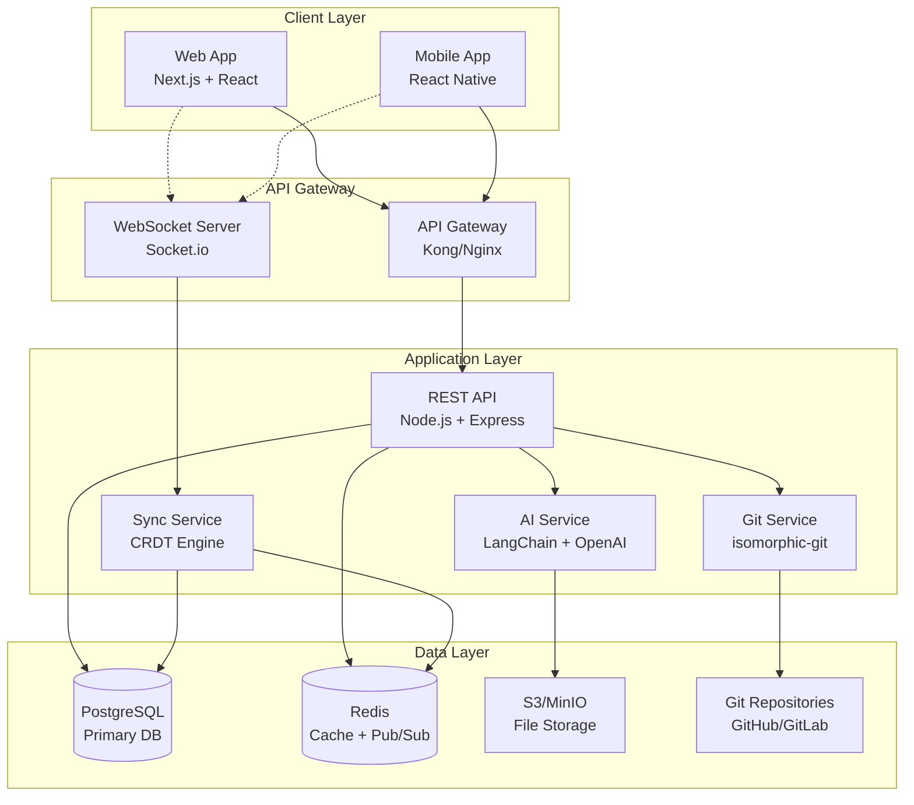
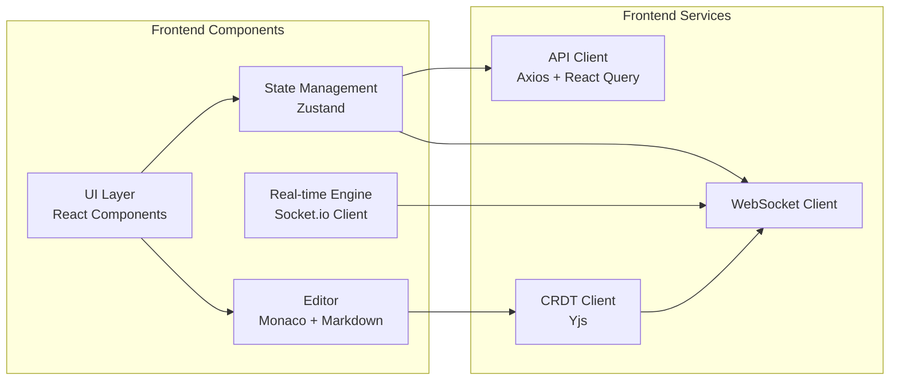
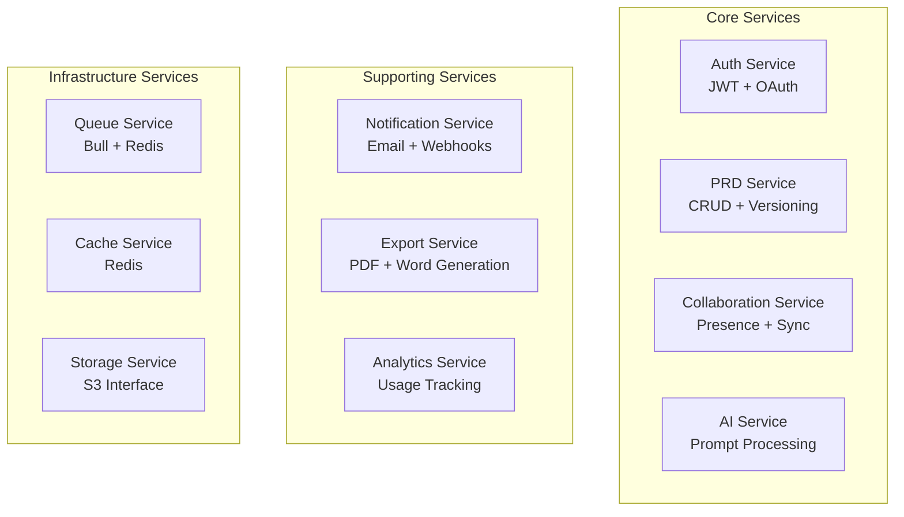
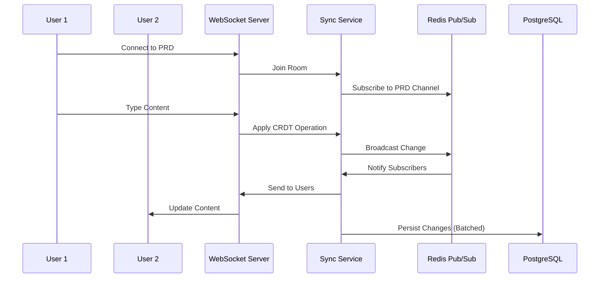
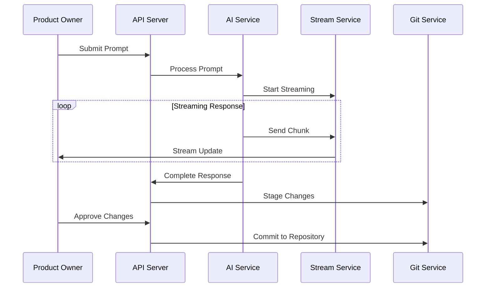
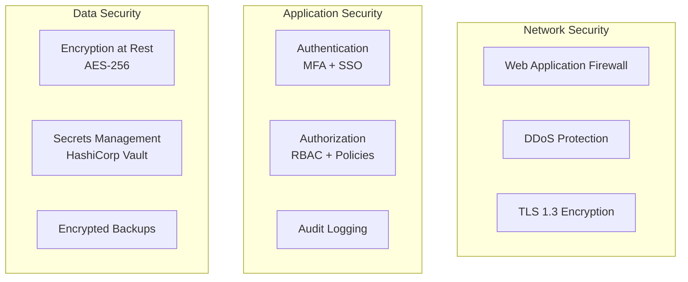
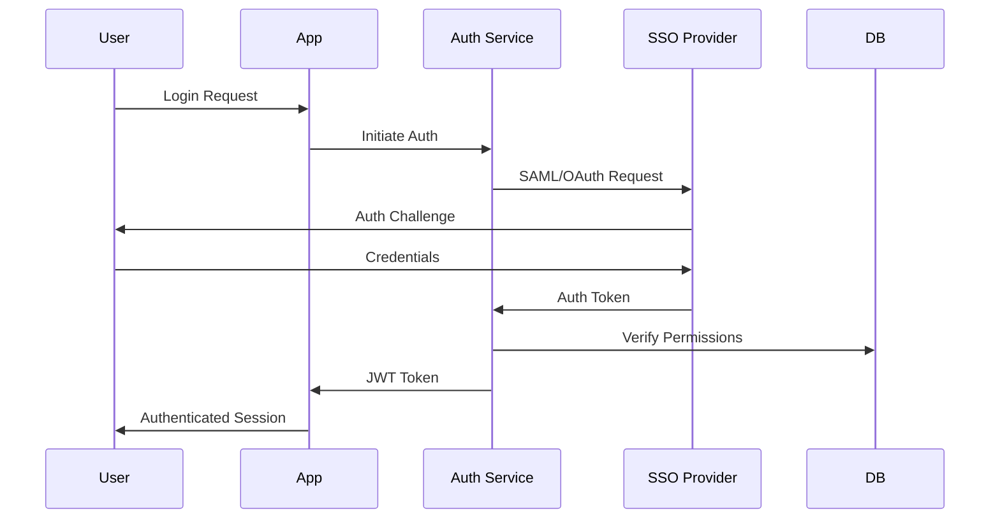
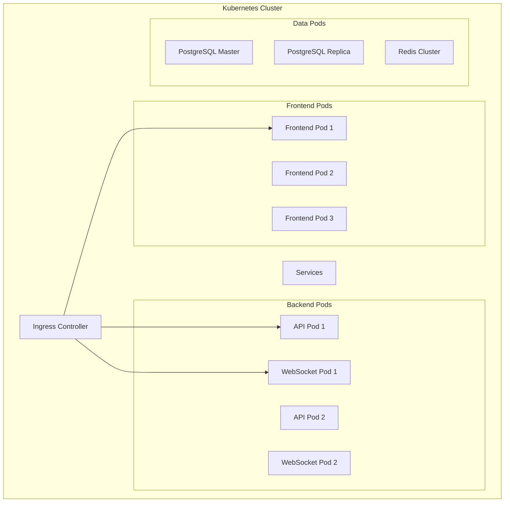
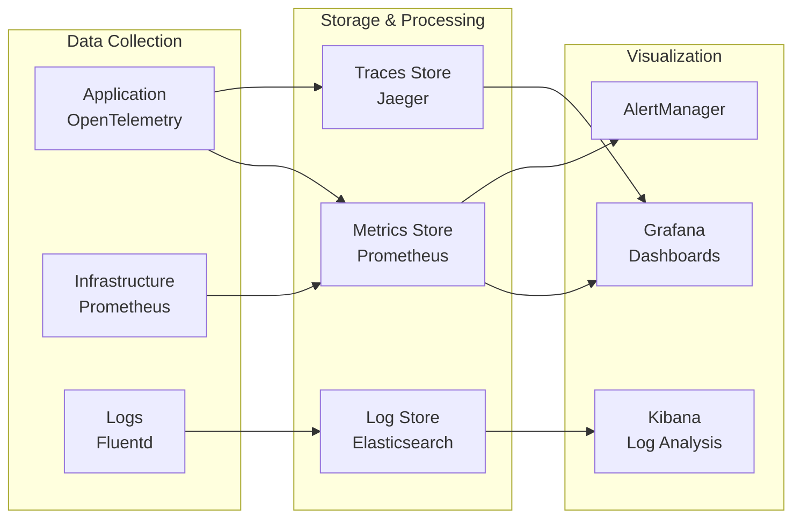

# System Architecture - PRD Tool

## 1. High-Level Architecture Overview



## 2. Component Architecture

### 2.1 Frontend Architecture


### 2.2 Backend Microservices


## 3. Data Flow Architecture

### 3.1 Real-time Collaboration Flow


### 3.2 AI Content Generation Flow


## 4. Security Architecture

### 4.1 Security Layers


### 4.2 Authentication Flow


## 5. Deployment Architecture

### 5.1 Container Architecture
```yaml
version: '3.8'
services:
  frontend:
    image: prd-tool/frontend:latest
    replicas: 3
    
  api:
    image: prd-tool/api:latest
    replicas: 5
    
  websocket:
    image: prd-tool/websocket:latest
    replicas: 3
    
  ai-service:
    image: prd-tool/ai:latest
    replicas: 2
    
  postgres:
    image: postgres:15
    replicas: 1 (with streaming replication)
    
  redis:
    image: redis:7-alpine
    replicas: 3 (cluster mode)
```

### 5.2 Kubernetes Architecture


## 6. Scalability Considerations

### 6.1 Horizontal Scaling Strategy
- **Frontend**: CDN distribution, edge caching
- **API Layer**: Load balanced, stateless services
- **WebSocket**: Sticky sessions with Redis pub/sub
- **Database**: Read replicas, connection pooling
- **AI Service**: Queue-based processing, GPU clusters

### 6.2 Performance Optimization
- **Caching Strategy**: Multi-layer (CDN, Redis, Application)
- **Database Optimization**: Indexes, partitioning, materialized views
- **Real-time Sync**: CRDT for conflict-free updates
- **AI Response**: Streaming with chunked transfer encoding

## 7. Monitoring and Observability

### 7.1 Monitoring Stack


### 7.2 Key Metrics
- **Application**: Response time, error rate, throughput
- **Real-time**: WebSocket connections, message latency
- **AI Service**: Token usage, response time, queue depth
- **Infrastructure**: CPU, memory, disk I/O, network