# Process Flows - PRD Tool

## 1. System Process Flows

### 1.1 Real-Time Synchronization Process
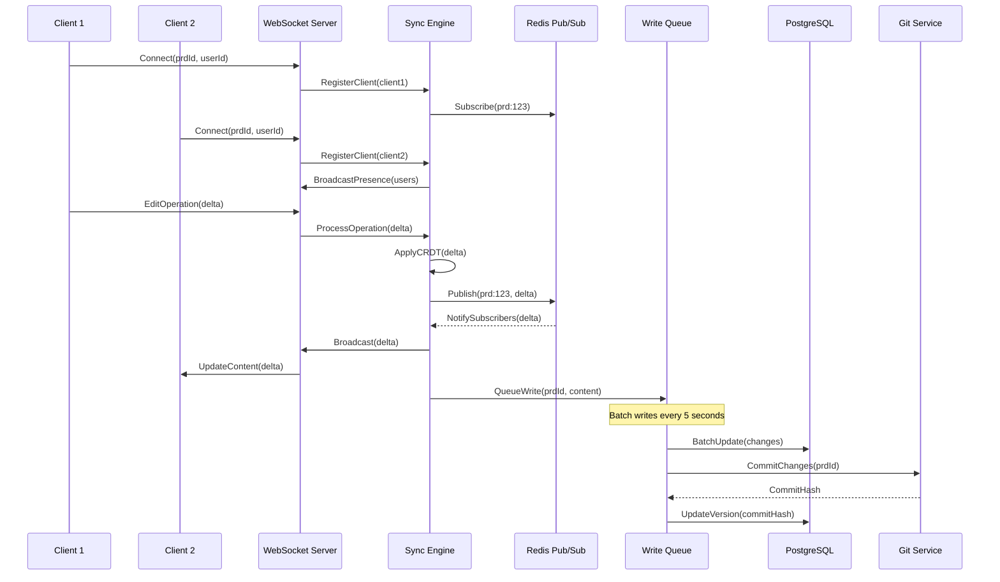

### 1.2 AI Content Generation Process
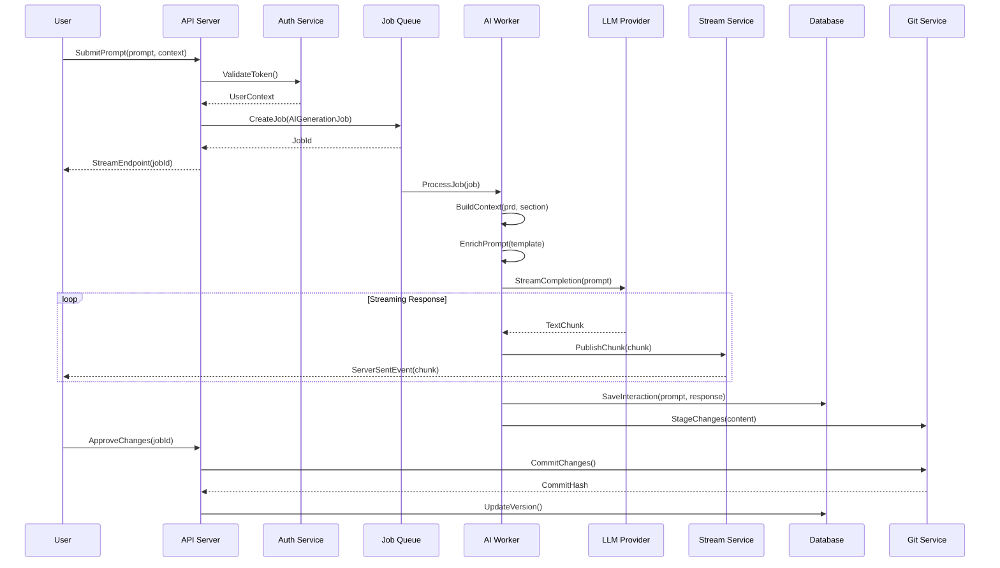

### 1.3 Version Control Process
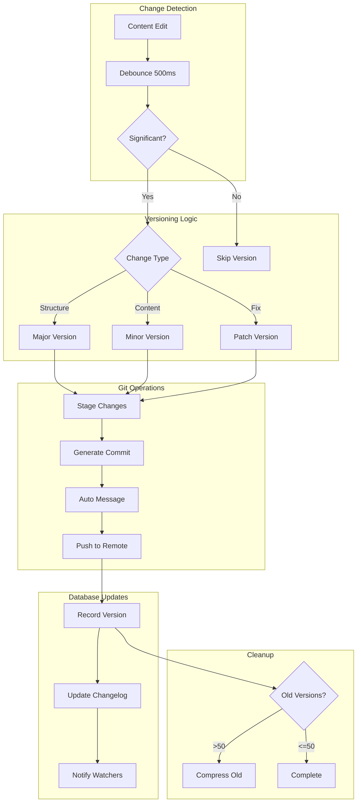

### 1.4 Authentication & Authorization Process
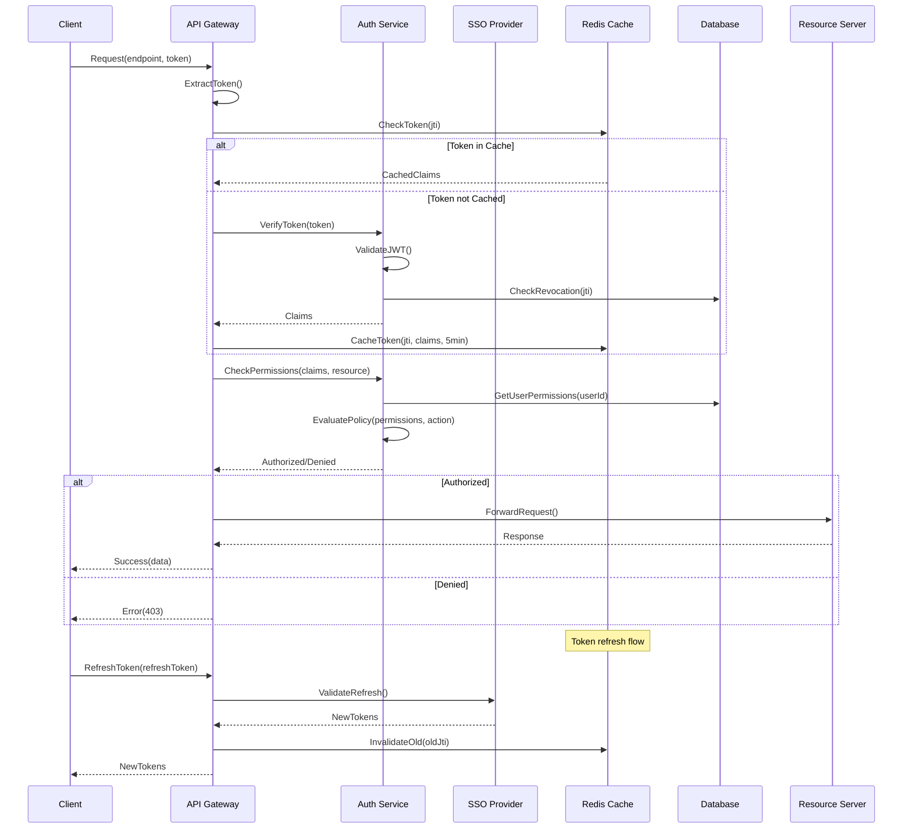

## 2. Data Processing Flows

### 2.1 Document Import Process
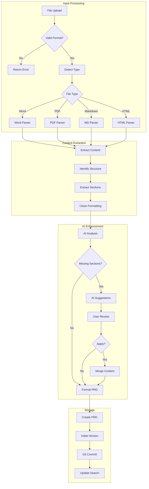

### 2.2 Search Indexing Process
```mermaid
sequenceDiagram
    participant PRD as PRD Service
    participant Queue as Index Queue
    participant Worker as Index Worker
    participant ES as Elasticsearch
    participant DB as PostgreSQL
    
    PRD->>DB: SavePRD(content)
    DB-->>PRD: Success
    
    PRD->>Queue: QueueIndexJob(prdId)
    
    Worker->>Queue: PollJobs()
    Queue-->>Worker: IndexJob(prdId)
    
    Worker->>DB: FetchPRD(prdId)
    DB-->>Worker: PRDData
    
    Worker->>Worker: ProcessContent()
    Note over Worker: Extract text, metadata, clean HTML
    
    Worker->>Worker: GenerateEmbeddings()
    Note over Worker: Create vector embeddings for semantic search
    
    Worker->>ES: IndexDocument({
        id: prdId,
        title: "...",
        content: "...",
        sections: [...],
        metadata: {...},
        embeddings: [...]
    })
    
    ES-->>Worker: Indexed
    
    Worker->>DB: UpdateIndexStatus(prdId)
```

### 2.3 Export Process
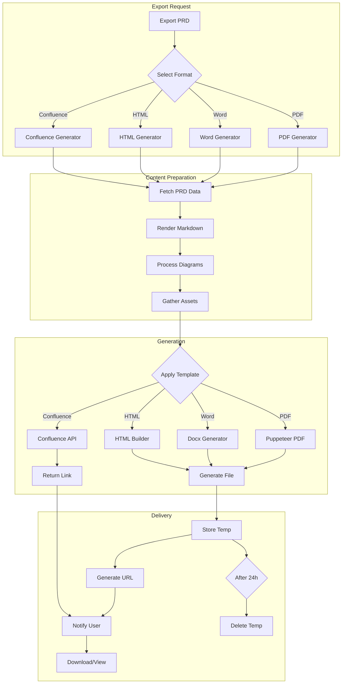

## 3. Integration Processes

### 3.1 Jira Synchronization Process
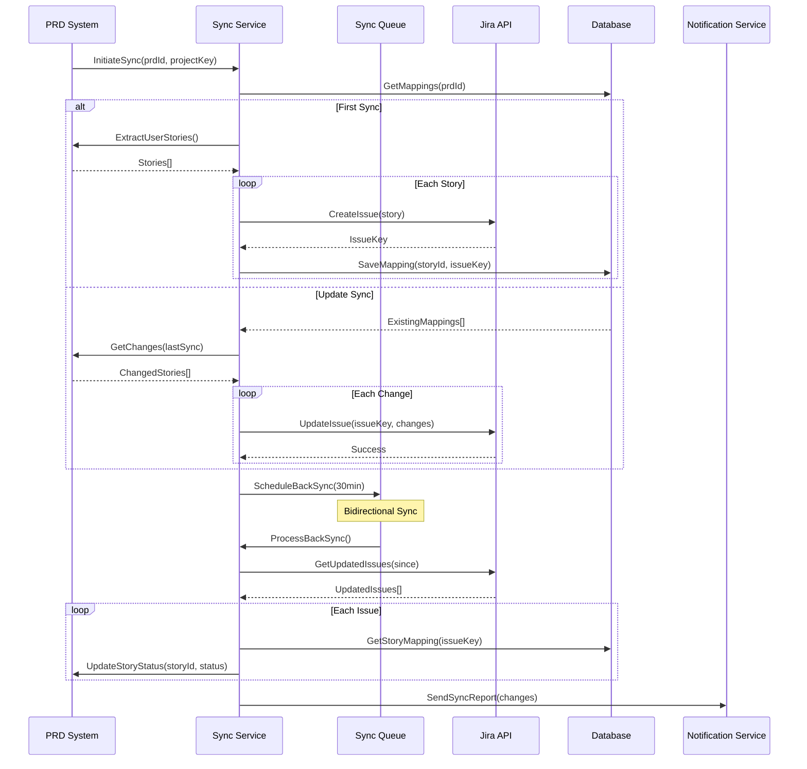

### 3.2 Chat Platform Integration Process (Slack/Mattermost)
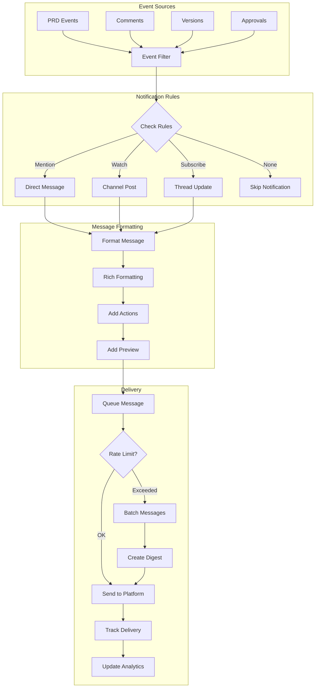

### 3.3 Craft.io Integration Process
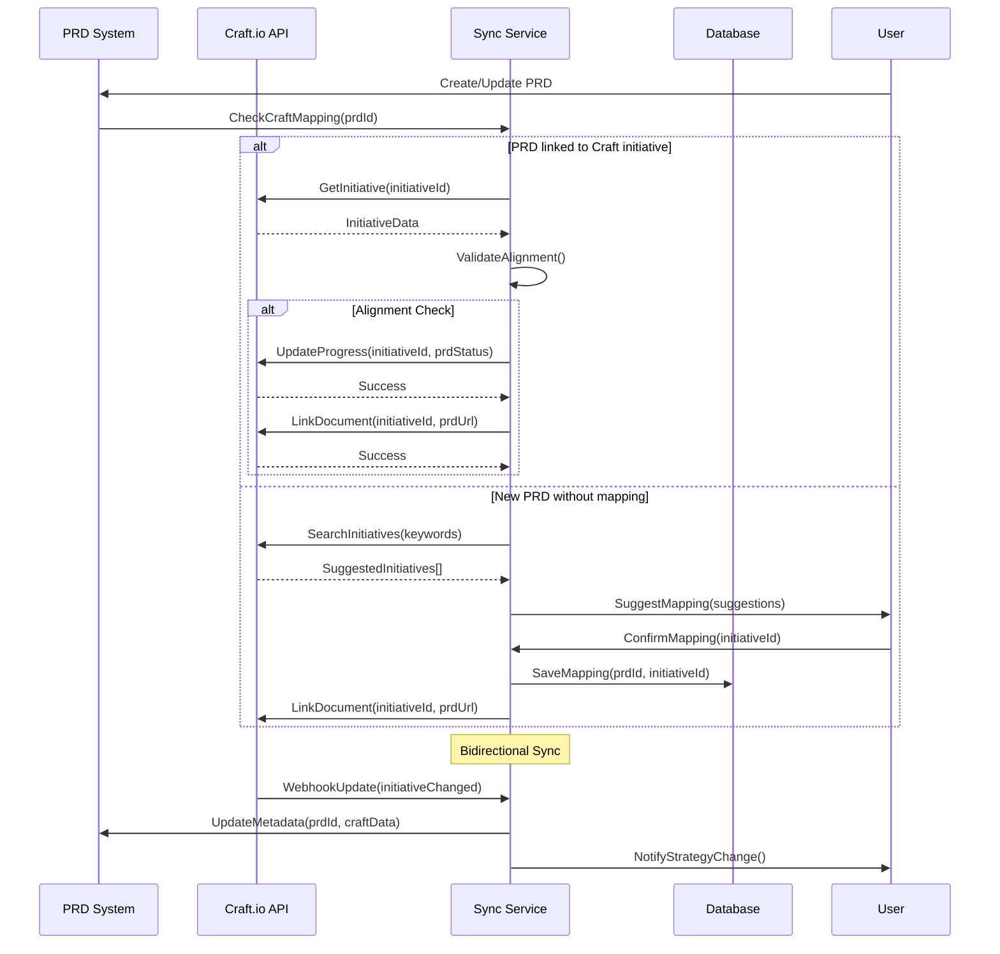

## 4. Background Processes

### 4.1 Auto-Save Process
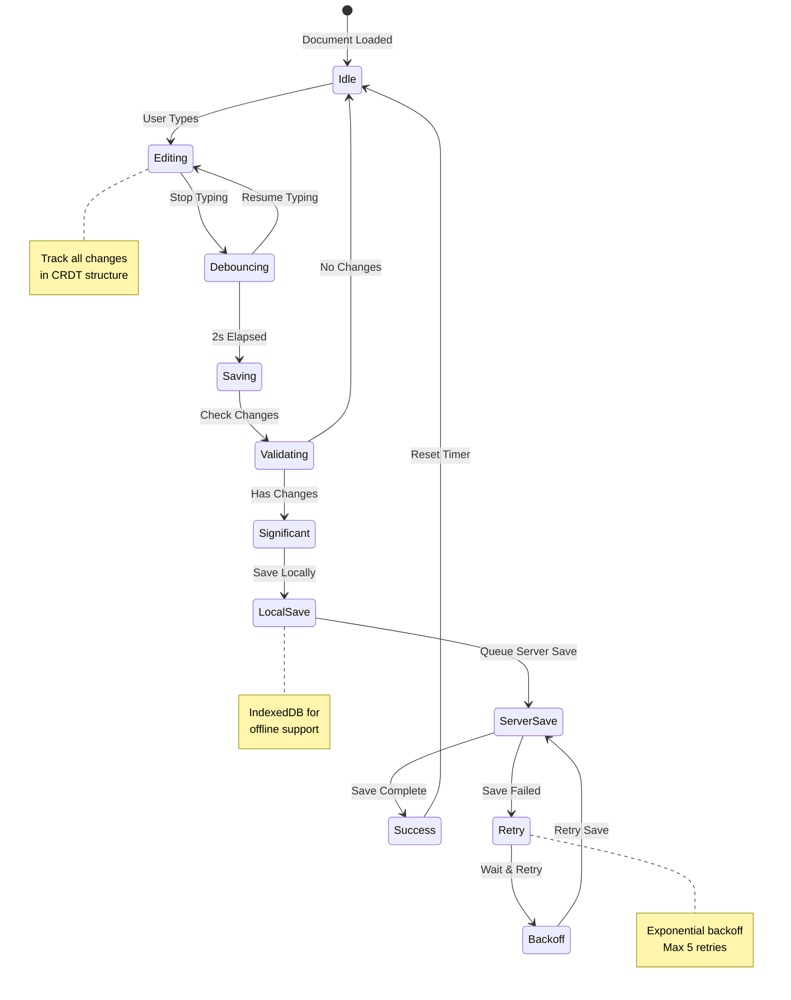

### 4.2 Garbage Collection Process
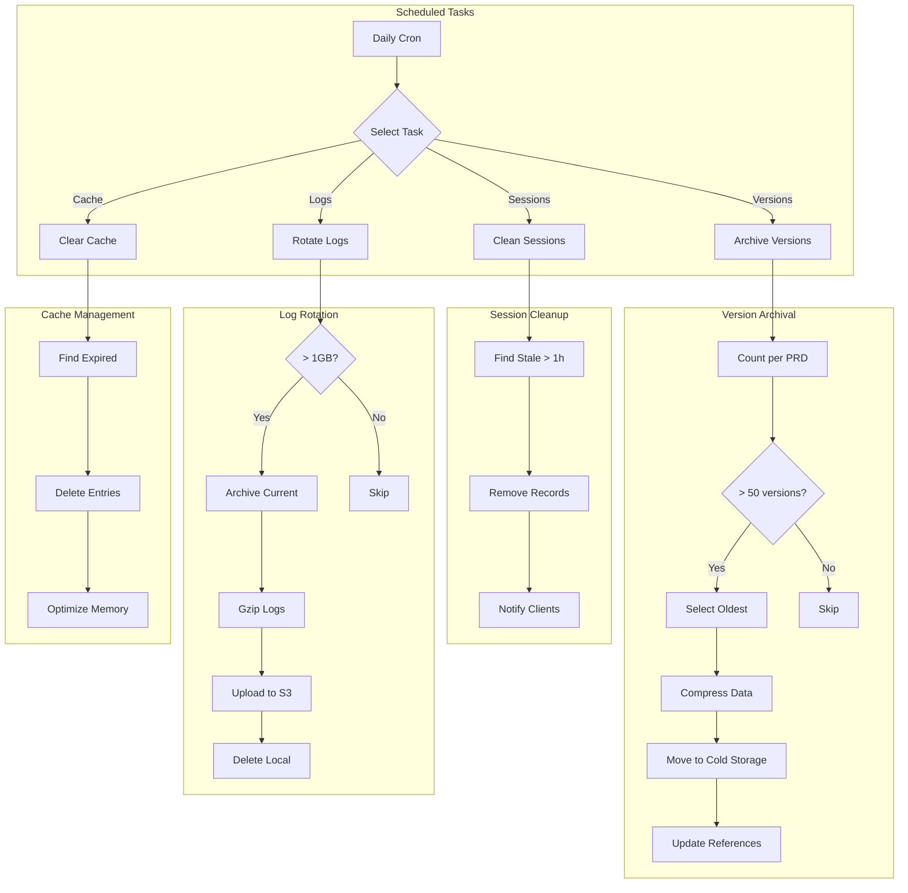

### 4.3 Analytics Processing
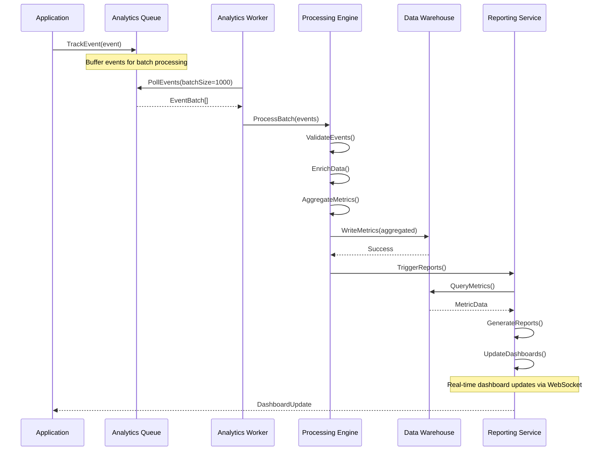

## 5. Security Processes

### 5.1 API Rate Limiting Process
```mermaid
graph TB
    subgraph "Request Flow"
        Request[API Request] --> Extract[Extract Identity]
        Extract --> Key{Identify Key}
        
        Key -->|User| UserKey[user:123]
        Key -->|IP| IPKey[ip:1.2.3.4]
        Key -->|API Key| APIKey[api:abc123]
    end
    
    subgraph "Rate Check"
        UserKey --> Check[Check Limits]
        IPKey --> Check
        APIKey --> Check
        
        Check --> Window{Time Window}
        Window -->|Minute| MinLimit[100 req/min]
        Window -->|Hour| HourLimit[1000 req/hr]
        Window -->|Day| DayLimit[10000 req/day]
    end
    
    subgraph "Decision"
        MinLimit --> Allow{Within Limit?}
        HourLimit --> Allow
        DayLimit --> Allow
        
        Allow -->|Yes| Increment[Increment Counter]
        Allow -->|No| Reject[429 Error]
        
        Increment --> Process[Process Request]
        Reject --> Headers[Add Headers]
        Headers --> Response[Return Response]
    end
    
    subgraph "Headers"
        Process --> AddHeaders[Add Rate Headers]
        AddHeaders --> Success[200 Response]
        
        Note over AddHeaders: X-RateLimit-Limit: 100
        Note over AddHeaders: X-RateLimit-Remaining: 67
        Note over AddHeaders: X-RateLimit-Reset: 1234567890
    end
```

### 5.2 Audit Logging Process
```mermaid
sequenceDiagram
    participant Client
    participant API as API Server
    participant MW as Audit Middleware
    participant Service as Business Logic
    participant Audit as Audit Service
    participant Queue as Audit Queue
    participant Store as Audit Store
    
    Client->>API: Request(action, data)
    API->>MW: ProcessRequest()
    
    MW->>MW: CaptureRequest({
        userId,
        action,
        resource,
        ip,
        userAgent,
        timestamp
    })
    
    MW->>Service: Forward()
    Service->>Service: ExecuteAction()
    Service-->>MW: Response
    
    MW->>MW: CaptureResponse({
        status,
        changes,
        duration
    })
    
    MW->>Audit: LogEvent(auditEntry)
    MW-->>Client: Response
    
    Note over Audit: Async processing
    
    Audit->>Queue: QueueEntry(auditEntry)
    Queue->>Store: BatchWrite(entries)
    
    Store->>Store: Partition by date
    Store->>Store: Index for search
    Store->>Store: Compress old data
```

## 6. Monitoring Processes

### 6.1 Health Check Process
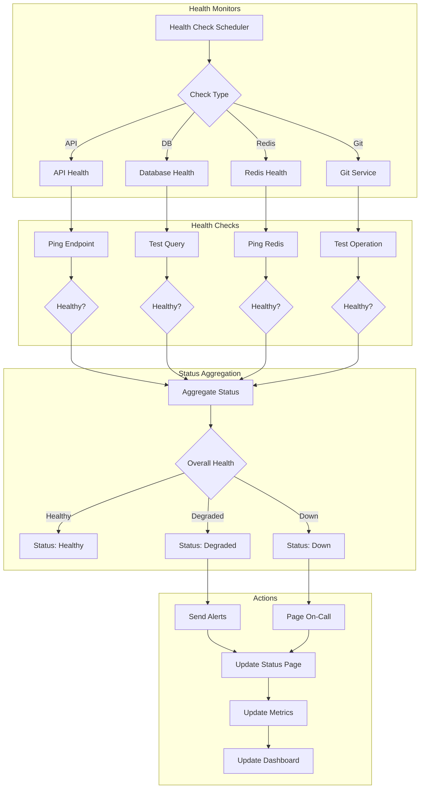

### 6.2 Performance Monitoring Process
```mermaid
sequenceDiagram
    participant App as Application
    participant APM as APM Agent
    participant Collector as Metrics Collector
    participant Processor as Processing Service
    participant Storage as Time Series DB
    participant Alert as Alert Manager
    participant Dash as Dashboard
    
    App->>APM: StartTransaction()
    
    App->>App: Execute Operation
    Note over App: Track spans, DB queries, external calls
    
    App->>APM: EndTransaction()
    
    APM->>Collector: SendMetrics({
        duration,
        spans,
        errors,
        metadata
    })
    
    Collector->>Processor: ProcessMetrics()
    
    Processor->>Processor: Aggregate()
    Processor->>Processor: CalculatePercentiles()
    
    Processor->>Storage: StoreMetrics()
    
    Storage->>Alert: CheckThresholds()
    
    alt Threshold Exceeded
        Alert->>Alert: TriggerAlert()
        Alert-->>OnCall: SendNotification()
    end
    
    Storage->>Dash: StreamMetrics()
    Dash->>Dash: UpdateVisualizations()
    
    Note over Dash: Real-time dashboards with:
    Note over Dash: - Response times
    Note over Dash: - Error rates
    Note over Dash: - Throughput
    Note over Dash: - Resource usage
```