# User Flows - PRD Tool

## 1. Core User Journeys

### 1.1 First-Time User Flow
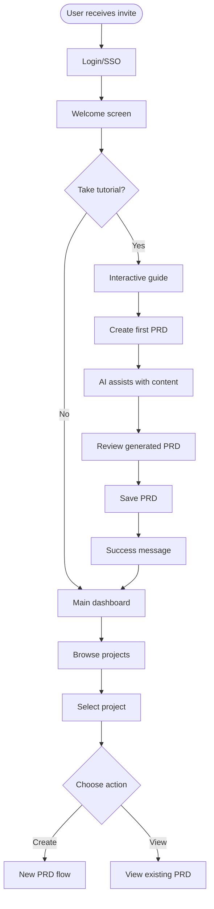

### 1.2 PRD Creation Flow
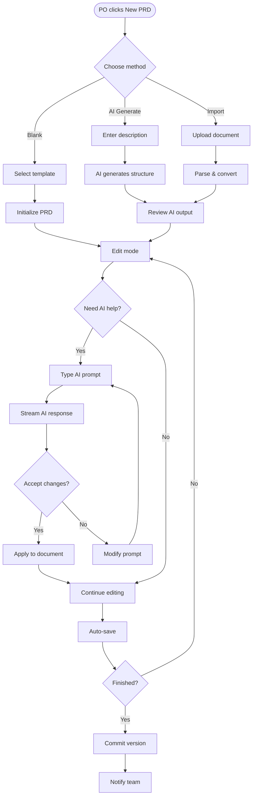

### 1.3 Real-Time Collaboration Flow
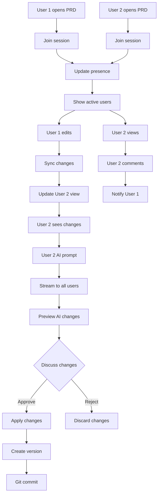

## 2. AI Interaction Flows

### 2.1 AI Content Generation Flow
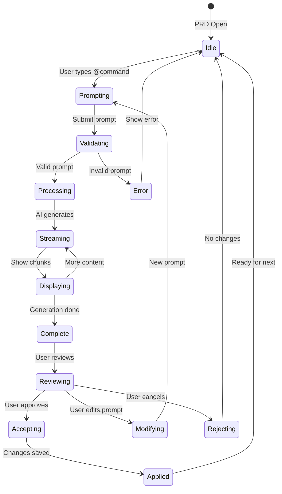

### 2.2 AI Command Flow
```mermaid
graph LR
    subgraph Commands
        Update[@update section]
        Diagram[@diagram description]
        Metrics[@metrics goals]
        Review[@review content]
        Suggest[@suggest improvements]
    end
    
    subgraph Processing
        Parse[Parse command]
        Context[Gather context]
        Generate[Generate content]
        Format[Format response]
    end
    
    subgraph Output
        Text[Text content]
        Mermaid[Mermaid diagram]
        List[Bullet list]
        Table[Table format]
    end
    
    Update --> Parse
    Diagram --> Parse
    Metrics --> Parse
    Review --> Parse
    Suggest --> Parse
    
    Parse --> Context
    Context --> Generate
    Generate --> Format
    
    Format --> Text
    Format --> Mermaid
    Format --> List
    Format --> Table
```

## 3. Version Control Flows

### 3.1 Version Management Flow
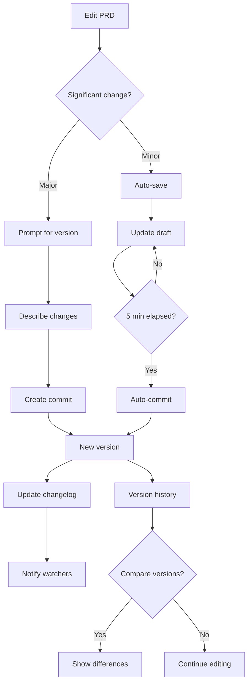

### 3.2 Conflict Resolution Flow
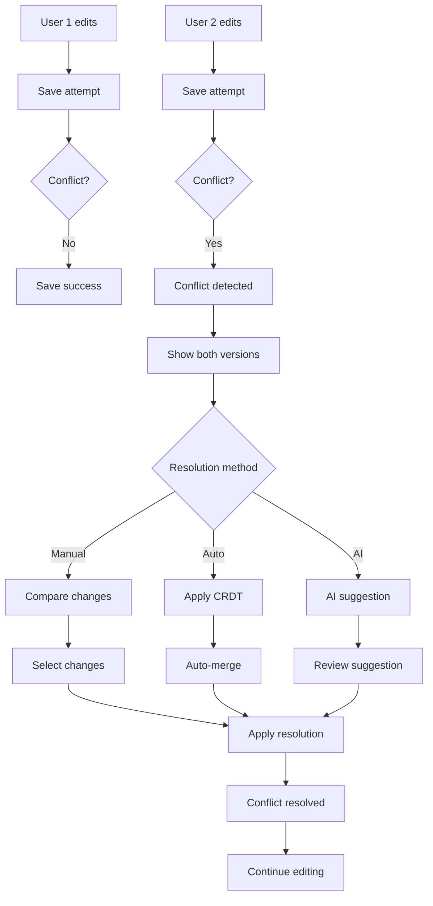

## 4. Integration Flows

### 4.1 Jira Integration Flow
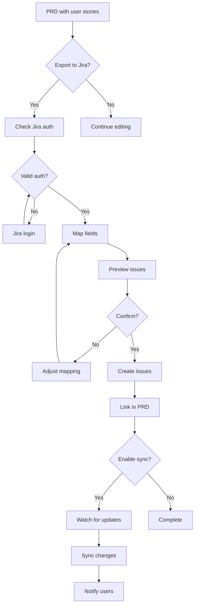

### 4.2 Slack Notification Flow
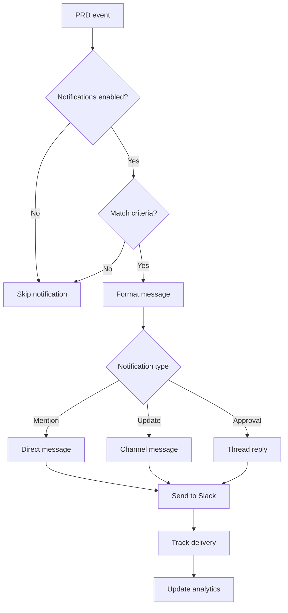

## 5. Search and Discovery Flows

### 5.1 PRD Search Flow
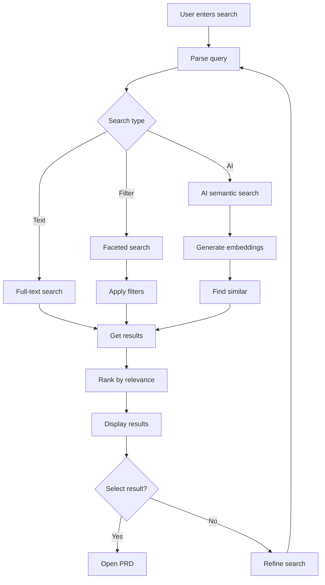

### 5.2 Navigation Flow
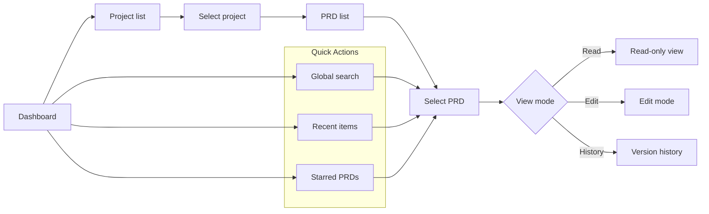

## 6. Administrative Flows

### 6.1 Team Management Flow
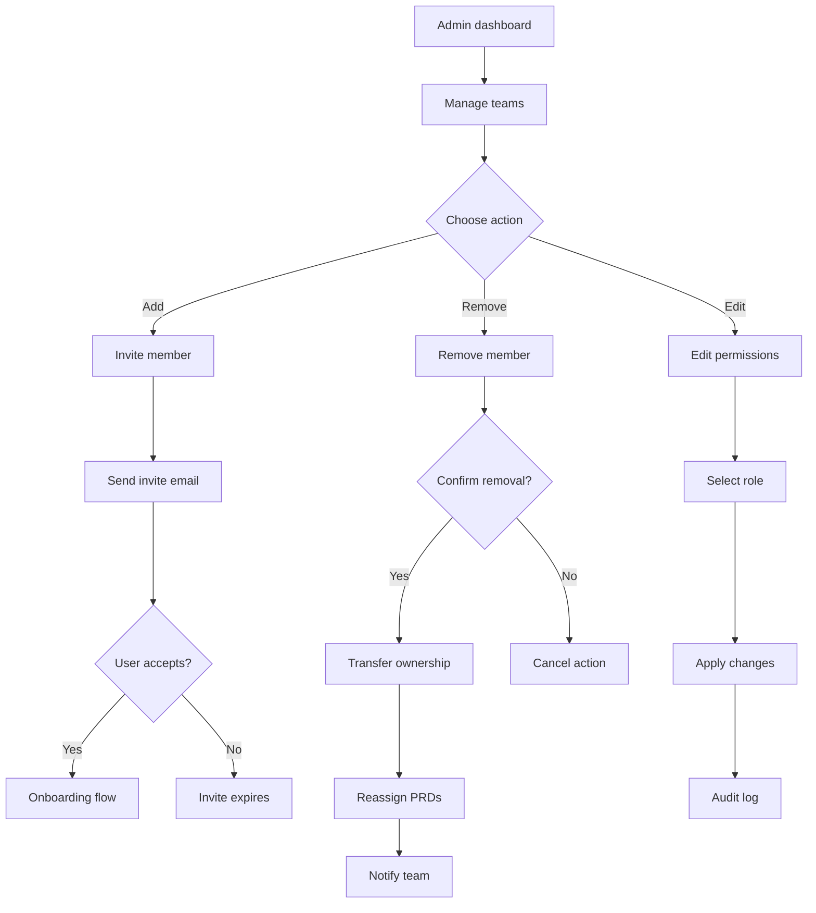

### 6.2 Settings Configuration Flow
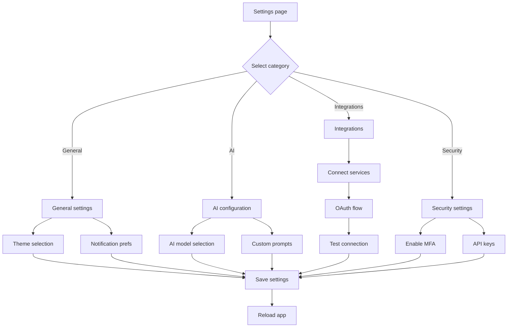

## 7. Error and Recovery Flows

### 7.1 Error Handling Flow
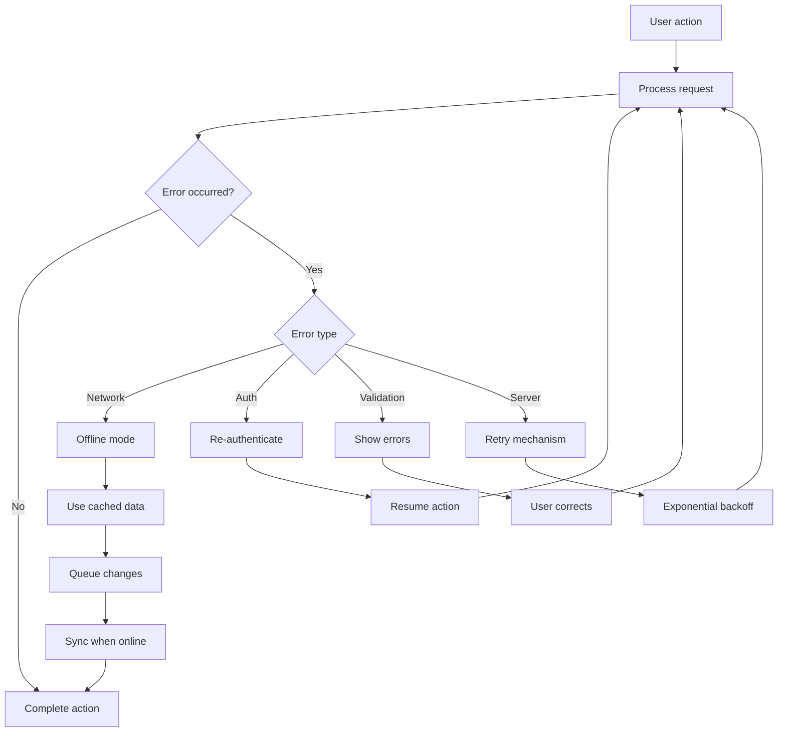

### 7.2 Recovery Flow
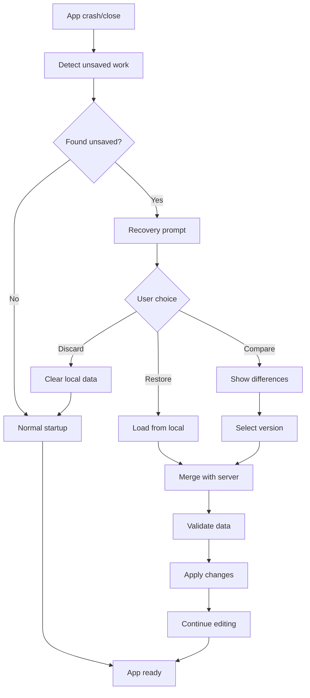

## 8. Mobile-Specific Flows

### 8.1 Mobile Editing Flow
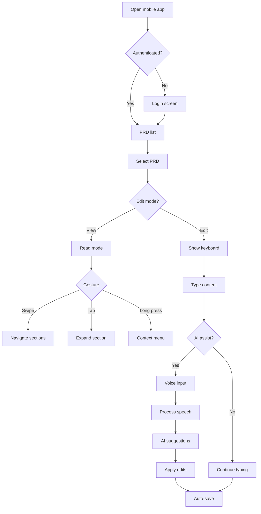

### 8.2 Offline Mobile Flow
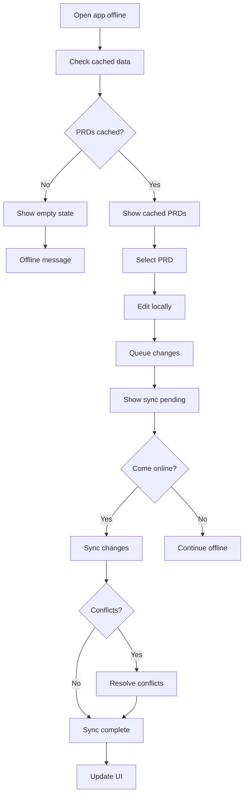