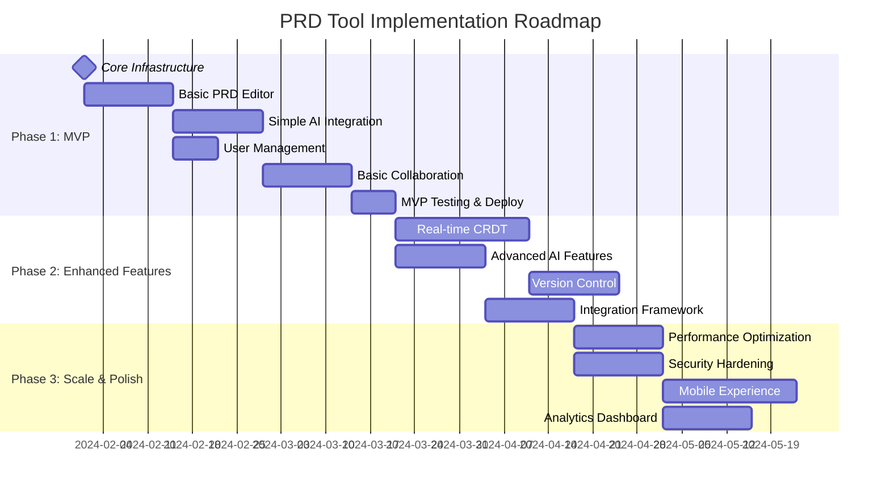

# Implementation Roadmap with Risk Mitigation - PRD Tool

## 1. Implementation Strategy Overview

### 1.1 Phased Approach with Risk Mitigation


## 2. Phase 1: MVP Implementation (8 weeks)

### 2.1 Week 1-2: Core Infrastructure
```typescript
interface Phase1Sprint1 {
  duration: '2 weeks';
  goal: 'Establish solid foundation';
  deliverables: [
    'Development environment setup',
    'Database schema implementation',
    'Basic authentication system',
    'Core API endpoints',
    'Frontend project structure'
  ];
  risks: RiskMitigation[];
}
```

#### High-Risk Areas & Mitigation
```typescript
const phase1Risks: RiskMitigation[] = [
  {
    risk: 'Database schema complexity',
    probability: 'Medium',
    impact: 'High',
    mitigation: [
      'Start with simplified schema, add complexity incrementally',
      'Use Prisma migrations for safe schema evolution',
      'Extensive testing of database operations'
    ],
    contingency: 'Rollback to simpler relational design if JSONB causes issues'
  },
  {
    risk: 'Authentication integration complexity',
    probability: 'Low',
    impact: 'Medium',
    mitigation: [
      'Use proven libraries (Passport.js, JWT)',
      'Start with simple email/password, add SSO later',
      'Implement rate limiting from day 1'
    ],
    contingency: 'Use Auth0 as managed service if custom auth proves complex'
  }
];
```

### 2.2 Week 3-4: Basic PRD Editor
```typescript
interface Phase1Sprint2 {
  duration: '2 weeks';
  goal: 'Functional PRD editing experience';
  deliverables: [
    'Monaco Editor integration',
    'Markdown rendering pipeline',
    'Basic document CRUD operations',
    'Simple auto-save functionality',
    'Template system foundation'
  ];
  criticalPath: [
    'Editor performance with large documents',
    'Auto-save reliability',
    'Markdown parsing edge cases'
  ];
}
```

#### Editor-Specific Risks
```typescript
const editorRisks: RiskMitigation[] = [
  {
    risk: 'Monaco Editor performance with large PRDs',
    probability: 'Medium',
    impact: 'High',
    mitigation: [
      'Implement virtual scrolling for large documents',
      'Lazy load Monaco Editor features',
      'Set document size limits (1MB warning, 2MB hard limit)'
    ],
    monitoring: 'Track editor load times and memory usage',
    contingency: 'Fallback to simpler textarea with syntax highlighting'
  },
  {
    risk: 'Auto-save conflicts and data loss',
    probability: 'Medium',
    impact: 'Critical',
    mitigation: [
      'Implement optimistic UI updates with rollback',
      'Local storage backup before each save attempt',
      'Conflict detection and user notification'
    ],
    testing: 'Extensive offline/online transition testing',
    contingency: 'Manual save mode with clear user feedback'
  }
];
```

### 2.3 Week 5-6: Simple AI Integration
```typescript
interface Phase1Sprint3 {
  duration: '2 weeks';
  goal: 'Basic AI-powered content generation';
  deliverables: [
    'Direct OpenAI/Anthropic API integration',
    'Prompt template system',
    'Streaming response handling',
    'Basic cost tracking',
    'Error handling and fallbacks'
  ];
  aiFeatures: [
    '@update section content',
    '@diagram simple flowcharts',
    'Basic content suggestions'
  ];
}
```

#### AI Integration Risks
```typescript
const aiRisks: RiskMitigation[] = [
  {
    risk: 'AI API rate limits and costs',
    probability: 'High',
    impact: 'High',
    mitigation: [
      'Implement aggressive request queuing and batching',
      'Set per-user and per-organization usage limits',
      'Real-time cost monitoring with alerts',
      'Prompt optimization to reduce token usage'
    ],
    monitoring: 'Track tokens per request, cost per user, API error rates',
    contingency: 'Fallback to cached responses, premium feature gating'
  },
  {
    risk: 'AI response quality and hallucinations',
    probability: 'Medium',
    impact: 'Medium',
    mitigation: [
      'Implement response validation and sanitization',
      'User feedback system for AI suggestions',
      'Clear labeling of AI-generated content',
      'Easy undo/redo for AI changes'
    ],
    testing: 'A/B testing of different prompts and models',
    contingency: 'Human review workflow for critical content'
  },
  {
    risk: 'Sensitive data in AI prompts',
    probability: 'Medium',
    impact: 'Critical',
    mitigation: [
      'Implement PII detection before sending to AI',
      'Prompt sanitization and data masking',
      'Audit trail of all AI interactions',
      'User consent for AI processing'
    ],
    compliance: 'GDPR-compliant data handling procedures',
    contingency: 'Local AI processing for sensitive content'
  }
];
```

### 2.4 Week 7-8: Basic Collaboration & Testing
```typescript
interface Phase1Sprint4 {
  duration: '2 weeks';
  goal: 'Multi-user functionality and MVP readiness';
  deliverables: [
    'Operational Transform implementation',
    'Real-time presence indicators',
    'Basic commenting system',
    'Comprehensive testing suite',
    'MVP deployment pipeline'
  ];
  testing: [
    'Load testing with 25 concurrent users per document',
    'Cross-browser compatibility testing',
    'Security penetration testing',
    'User acceptance testing'
  ];
}
```

#### Collaboration Risks
```typescript
const collaborationRisks: RiskMitigation[] = [
  {
    risk: 'Real-time sync conflicts and data corruption',
    probability: 'High',
    impact: 'Critical',
    mitigation: [
      'Start with simple Operational Transforms',
      'Server-authoritative conflict resolution',
      'Extensive conflict scenario testing',
      'Automatic backup before each operation'
    ],
    fallback: 'Lock-based editing if OT proves too complex',
    monitoring: 'Track operation success rates, conflict frequency'
  },
  {
    risk: 'WebSocket scalability and connection management',
    probability: 'Medium',
    impact: 'High',
    mitigation: [
      'Implement connection pooling and load balancing',
      'Graceful degradation to polling if WebSocket fails',
      'Connection health monitoring and auto-reconnection',
      'Redis pub/sub for horizontal scaling'
    ],
    testing: 'Load testing with 1000+ concurrent connections',
    contingency: 'Traditional request-response model with periodic sync'
  }
];
```

## 3. Phase 2: Enhanced Features (8 weeks)

### 3.1 Advanced Real-time Collaboration
```typescript
interface Phase2Goals {
  duration: '8 weeks';
  focus: 'Scale and sophistication';
  majorUpgrades: [
    'Operational Transforms → CRDT (Yjs)',
    'Basic AI → Advanced LangChain integration',
    'Simple collaboration → Rich presence and commenting',
    'Basic integrations → Deep platform integrations'
  ];
  riskProfile: 'Medium - Building on proven MVP foundation';
}
```

#### CRDT Migration Strategy
```typescript
const crdtMigration: MigrationPlan = {
  approach: 'Gradual rollout with feature flags',
  phases: [
    {
      week: 1,
      scope: 'Implement Yjs alongside existing OT',
      users: 'Internal team only'
    },
    {
      week: 2,
      scope: 'A/B test with 10% of users',
      monitoring: 'Conflict resolution accuracy, performance'
    },
    {
      week: 3,
      scope: 'Rollout to 50% of users',
      rollbackCriteria: '>5% error rate or >2x latency'
    },
    {
      week: 4,
      scope: '100% rollout',
      cleanup: 'Remove OT code after 2 weeks of stability'
    }
  ],
  risks: [
    {
      risk: 'CRDT learning curve and complexity',
      mitigation: 'Extensive documentation and team training',
      contingency: 'Revert to OT if team cannot maintain CRDT'
    }
  ]
};
```

### 3.2 Integration Deep Dive
```typescript
interface IntegrationPriority {
  phase2Integrations: [
    {
      integration: 'Slack',
      priority: 'High',
      complexity: 'Medium',
      timeline: '2 weeks',
      features: ['Rich notifications', 'Action buttons', 'Thread creation']
    },
    {
      integration: 'Jira',
      priority: 'High', 
      complexity: 'High',
      timeline: '3 weeks',
      features: ['Bidirectional sync', 'User story export', 'Status tracking']
    },
    {
      integration: 'Mattermost',
      priority: 'Medium',
      complexity: 'Medium',
      timeline: '2 weeks',
      features: ['Deep chat integration', 'PRD previews', 'Action workflows']
    }
  ];
}
```

## 4. Risk Management Framework

### 4.1 Continuous Risk Assessment
```typescript
class RiskManagementService {
  private risks: ProjectRisk[] = [];
  
  async assessWeeklyRisks(): Promise<RiskAssessment> {
    const currentRisks = await this.identifyCurrentRisks();
    const riskChanges = this.compareWithPreviousWeek(currentRisks);
    
    return {
      newRisks: riskChanges.new,
      escalatedRisks: riskChanges.escalated,
      mitigatedRisks: riskChanges.resolved,
      actionItems: await this.generateActionItems(currentRisks),
      nextReviewDate: new Date(Date.now() + 7 * 24 * 60 * 60 * 1000)
    };
  }
  
  private async identifyCurrentRisks(): Promise<ProjectRisk[]> {
    return [
      await this.assessTechnicalRisks(),
      await this.assessResourceRisks(),
      await this.assessTimelineRisks(),
      await this.assessBusinessRisks()
    ].flat();
  }
}
```

### 4.2 Automated Risk Monitoring
```typescript
interface RiskMonitoring {
  technicalMetrics: {
    buildFailureRate: number; // Alert if > 10%
    testCoverage: number; // Alert if < 80%
    apiErrorRate: number; // Alert if > 5%
    performanceDegradation: number; // Alert if > 20% slower
  };
  
  resourceMetrics: {
    teamCapacity: number; // Sprint velocity tracking
    expertiseGaps: string[]; // Skills needed vs available
    burnoutRisk: number; // Based on work patterns
  };
  
  businessMetrics: {
    stakeholderSatisfaction: number; // Weekly surveys
    scopeCreep: number; // Requirements change rate
    budgetVariance: number; // Cost vs planned
  };
}
```

### 4.3 Contingency Plans

#### Technical Contingencies
```typescript
const technicalContingencies: ContingencyPlan[] = [
  {
    trigger: 'Real-time collaboration proves too complex',
    plan: [
      'Implement lock-based editing instead',
      'Add clear indicators of who is editing',
      'Implement save conflict resolution UI',
      'Plan for future upgrade to full real-time'
    ],
    timeline: '1 week to implement fallback',
    impact: 'Reduced user experience, but functional collaboration'
  },
  {
    trigger: 'AI costs exceed budget by 50%',
    plan: [
      'Implement aggressive prompt optimization',
      'Add user-based usage limits',
      'Cache common responses',
      'Move AI features to premium tier'
    ],
    timeline: '2 weeks to implement cost controls',
    impact: 'Limited AI usage, potential revenue impact'
  },
  {
    trigger: 'Database performance issues at scale',
    plan: [
      'Implement read replicas',
      'Add database connection pooling',
      'Optimize expensive queries',
      'Consider database sharding strategy'
    ],
    timeline: '3 weeks for full optimization',
    impact: 'Temporary performance degradation'
  }
];
```

#### Resource Contingencies
```typescript
const resourceContingencies: ContingencyPlan[] = [
  {
    trigger: 'Key developer leaves during critical phase',
    plan: [
      'Immediately reassign critical tasks',
      'Implement knowledge transfer sessions',
      'Consider contractor augmentation',
      'Extend timeline if necessary'
    ],
    prevention: [
      'Maintain comprehensive documentation',
      'Cross-train team members on critical systems',
      'Regular knowledge sharing sessions'
    ]
  },
  {
    trigger: 'Team capacity drops below 80%',
    plan: [
      'Prioritize core features only',
      'Defer nice-to-have features',
      'Consider reducing scope for current phase',
      'Evaluate contractor support'
    ],
    earlyWarning: 'Monitor team velocity and happiness metrics'
  }
];
```

## 5. Success Criteria & Go/No-Go Gates

### 5.1 Phase 1 Success Criteria
```typescript
interface Phase1SuccessCriteria {
  functionalRequirements: {
    canCreatePRD: boolean;
    canEditCollaboratively: boolean;
    aiGeneratesContent: boolean;
    userCanAuthenticate: boolean;
    dataIsPersisted: boolean;
  };
  
  performanceRequirements: {
    pageLoadTime: number; // < 3 seconds
    saveLatency: number; // < 2 seconds
    collaborationLatency: number; // < 500ms
    aiResponseTime: number; // < 5 seconds to start
  };
  
  qualityRequirements: {
    testCoverage: number; // > 80%
    bugCount: number; // < 10 critical bugs
    securityVulnerabilities: number; // 0 high severity
  };
  
  userAcceptance: {
    coreWorkflowCompletion: number; // > 90%
    userSatisfactionScore: number; // > 7/10
    taskCompletionTime: number; // < 15 minutes for first PRD
  };
}
```

### 5.2 Go/No-Go Decision Framework
```typescript
class GoNoGoEvaluator {
  evaluatePhaseReadiness(phase: string, metrics: PhaseMetrics): Decision {
    const weights = {
      functionality: 0.4,
      performance: 0.3,
      quality: 0.2,
      userAcceptance: 0.1
    };
    
    const scores = {
      functionality: this.evaluateFunctionality(metrics),
      performance: this.evaluatePerformance(metrics),
      quality: this.evaluateQuality(metrics),
      userAcceptance: this.evaluateUserAcceptance(metrics)
    };
    
    const overallScore = Object.entries(scores)
      .reduce((sum, [key, score]) => sum + score * weights[key], 0);
    
    if (overallScore >= 0.8) {
      return { decision: 'GO', confidence: overallScore, risks: [] };
    } else if (overallScore >= 0.6) {
      return { 
        decision: 'GO_WITH_CONDITIONS', 
        confidence: overallScore,
        conditions: this.generateConditions(scores)
      };
    } else {
      return { 
        decision: 'NO_GO', 
        confidence: overallScore,
        blockers: this.identifyBlockers(scores)
      };
    }
  }
}
```

## 6. Monitoring and Course Correction

### 6.1 Weekly Health Checks
```typescript
interface WeeklyHealthCheck {
  technicalHealth: {
    buildStatus: 'green' | 'yellow' | 'red';
    testResults: TestSummary;
    performanceMetrics: PerformanceSnapshot;
    securityStatus: SecurityAssessment;
  };
  
  teamHealth: {
    velocity: number;
    burnoutRisk: 'low' | 'medium' | 'high';
    satisfactionScore: number;
    skillGaps: string[];
  };
  
  projectHealth: {
    scopeStability: 'stable' | 'minor_changes' | 'major_changes';
    timelineConfidence: number; // 0-100%
    budgetStatus: 'on_track' | 'slight_overrun' | 'significant_overrun';
    stakeholderSatisfaction: number;
  };
}
```

### 6.2 Adaptive Planning
```typescript
class AdaptivePlanner {
  async adjustPlanBasedOnLearnings(learnings: ProjectLearning[]): Promise<PlanAdjustment> {
    const adjustments: PlanAdjustment = {
      timelineChanges: [],
      scopeChanges: [],
      resourceChanges: [],
      processChanges: []
    };
    
    for (const learning of learnings) {
      switch (learning.category) {
        case 'technical_complexity':
          if (learning.impact === 'higher_than_expected') {
            adjustments.timelineChanges.push({
              task: learning.task,
              originalEstimate: learning.originalEstimate,
              newEstimate: learning.originalEstimate * 1.5,
              reason: learning.description
            });
          }
          break;
          
        case 'user_feedback':
          if (learning.priority === 'high') {
            adjustments.scopeChanges.push({
              type: 'addition',
              feature: learning.feature,
              justification: learning.userFeedback,
              estimatedEffort: learning.effort
            });
          }
          break;
      }
    }
    
    return adjustments;
  }
}
```

This comprehensive roadmap provides a structured approach to implementing the PRD Tool while proactively managing risks and maintaining flexibility for course corrections.